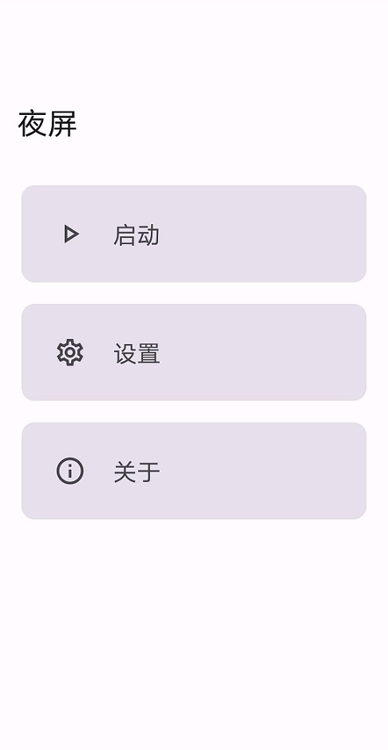
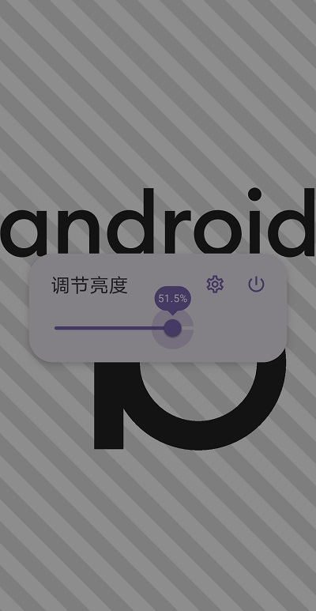
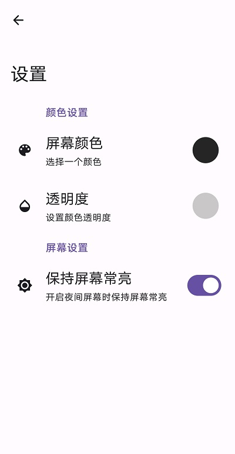
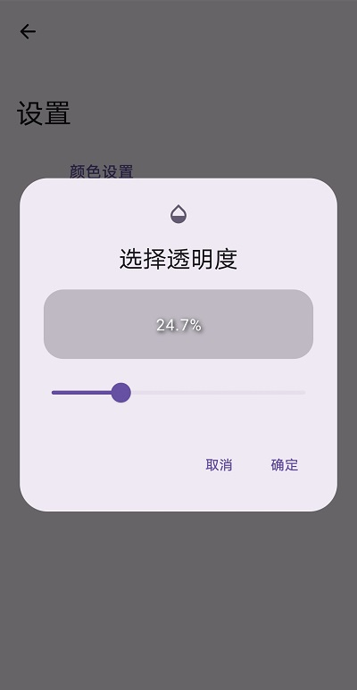
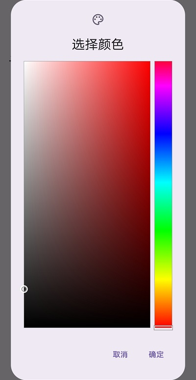
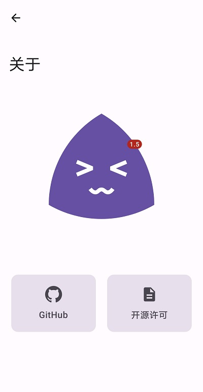
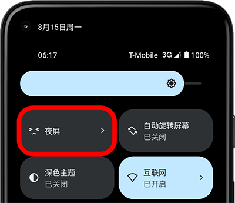
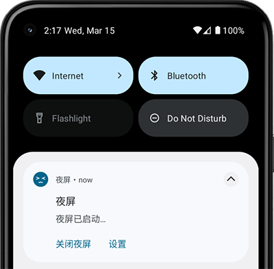

    

        
    

    <h1>🌙 Night Screen</h1>
    

        
        
        
        
        
	

    

        当您在<b>夜间🌙</b>使用手机时，Night Screen 可以帮助您<b>减少屏幕亮度</b>，减少对眼睛的伤害。
    

    

        软件完全采用<b> <a href="https://m3.material.io/">Material You</a> </b>设计风格。除全局 Dialog 外，<b>完全使用 <a href="https://developer.android.com/jetpack/compose">Jetpack Compose</a> </b>开发。
    

## 💡主要功能

- 支持从系统下拉**任务栏开关启动**
- 支持调整**屏幕颜色**
- 支持屏幕**常亮**
- 支持**自动降低系统亮度**
- 支持运行时通知栏显示**常驻通知**
- ……

## 📸应用截图

 
 
 
 

## 🛠主要技术栈

- Jetpack **Compose**
- **Material You**
- **ViewModel**
- **Hilt**
- Splash Screen
- Navigation
- Coil
- Profile Installer

## ✨其他应用

<table>
<thead>
  <tr>
    <th>工具</th>
    <th>描述</th>
    <th>传送门</th>
  </tr>
</thead>
<tbody>
  <tr>
    <td></td>
    <td><b>Raca (Record All Classic Articles)</b>，一个在本地<b>记录、查找抽象段落/评论区小作文</b>的工具。 🤗 您还在为记不住小作文内容，面临<b>前面、中间、后面都忘了</b>的尴尬处境吗？使用这款工具将<b>帮助您记录您所遇到的小作文</b>，再也不因为忘记而烦恼！😋</td>
    <td><a href="https://github.com/SkyD666/Raca-Android">https://github.com/SkyD666/Raca-Android</a></td>
  </tr>
  <tr>
    <td></td>
    <td><b>Rays (Record All Your Stickers)</b>，一个在本地<b>记录、查找、管理表情包</b>的工具。 🥰 您还在为手机中的<b>表情包太多</b>，找不到想要的表情包而苦恼吗？使用这款工具将帮助您<b>管理您存储的表情包</b>，再也不因为找不到表情包而烦恼！😋</td>
    <td><a href="https://github.com/SkyD666/Rays-Android">https://github.com/SkyD666/Rays-Android</a></td>
  </tr>
</tbody>
</table>

## 📃许可证

使用此软件代码需**遵循以下许可证协议**

[**GNU General Public License v3.0**](LICENSE)